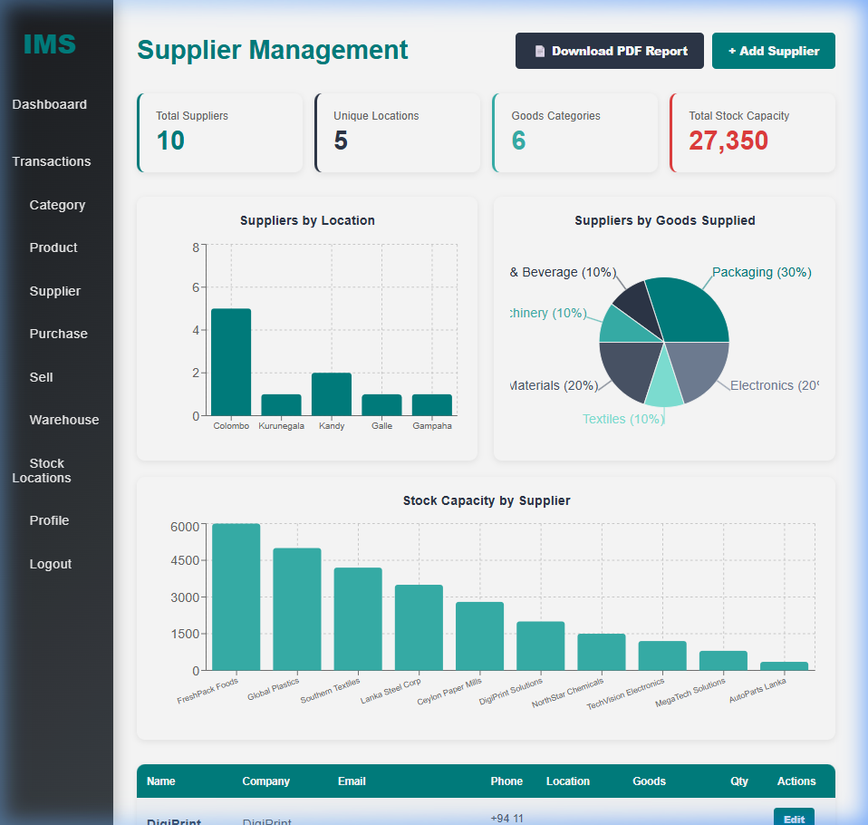
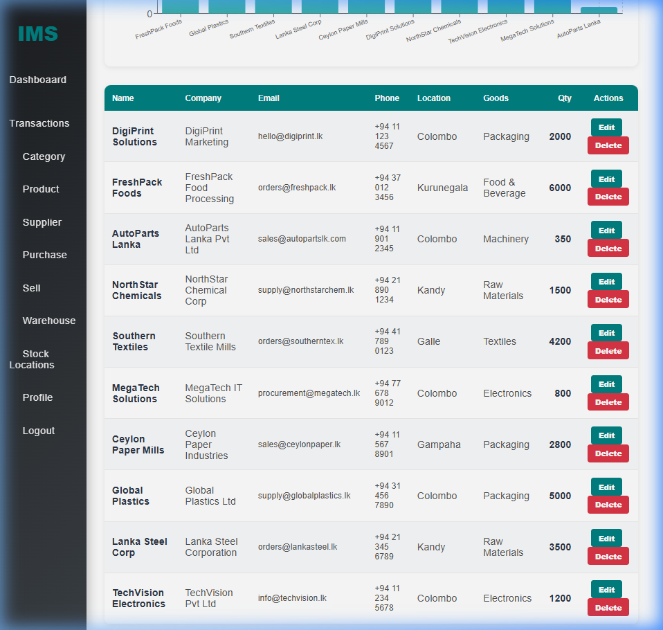
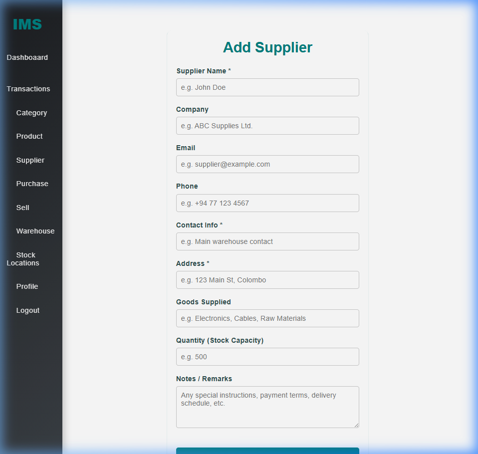

<div align="center">

# 📦 IMS – Inventory Management System

### A Modern Full-Stack Inventory Management System

[](https://spring.io/projects/spring-boot)
[](https://reactjs.org/)
[](https://openjdk.org/)
[](LICENSE)

*Built with React.js frontend and Spring Boot backend for efficient product, supplier, and stock management.*

</div>

---

## 📖 Table of Contents

- [Overview](#-overview)
- [Tech Stack](#-tech-stack)
- [Module: Supplier Management](#-module-supplier-management)
- [Features](#-features)
- [Screenshots](#-screenshots)
- [Getting Started](#-getting-started)
- [API Endpoints](#-api-endpoints)
- [Team Members](#-team-members)

---

## 🔍 Overview

IMS is a centralized platform to monitor inventory, manage products, track stock levels, and handle supplier relationships. The application integrates a **React-based frontend** with a **Spring Boot REST API**, providing real-time data visualization and PDF report generation.

---

## 🛠 Tech Stack

| Layer        | Technology                              |
|-------------|----------------------------------------|
| **Frontend** | React.js, Recharts, jsPDF, Axios       |
| **Backend**  | Spring Boot 3.3.5, Spring Security, JPA |
| **Database** | H2 (Dev) / MySQL (Production)          |
| **Auth**     | JWT (JSON Web Tokens)                  |
| **Build**    | Maven, npm                             |

---

## 📊 Module: Supplier Management

> **Developed by:** Rathnasinghe S J R — IT22908124  
> **Branch:** `shevin`

This module implements **FR5 – Supplier Management** with the following capabilities:

### ✅ Core CRUD Operations
- **Add** new suppliers with comprehensive details
- **View** all suppliers in a sortable data table
- **Update** existing supplier information
- **Delete** suppliers with confirmation dialog

### 📈 Analytics Dashboard
- **Summary Cards** — Total Suppliers, Unique Locations, Goods Categories, Total Stock Capacity
- **Bar Chart** — Supplier distribution by geographic location
- **Pie Chart** — Supplier breakdown by goods/product category
- **Capacity Chart** — Stock capacity comparison across all suppliers

### 📄 Report Generation
- **PDF Export** — Generate a professionally formatted, landscape PDF report containing all supplier data with auto-formatted tables

### 🗃 Supplier Data Fields

| Field            | Type     | Description                                    |
|-----------------|----------|------------------------------------------------|
| Name            | String   | Supplier contact name                          |
| Company         | String   | Organization / business name                   |
| Email           | String   | Business email address                         |
| Phone           | String   | Direct phone number                            |
| Contact Info    | String   | Primary contact person details                 |
| Address         | String   | Physical location / city                       |
| Goods Supplied  | String   | Category of products supplied                  |
| Quantity        | Integer  | Stock capacity / supply volume                 |
| Notes           | Text     | Payment terms, delivery schedule, remarks      |

---

## 📸 Screenshots

### Supplier Analytics Dashboard
*Summary cards with KPI metrics, Bar chart (by location), Pie chart (by goods type), and Stock capacity chart.*



### Supplier Data Table
*Professional data table with all supplier details, Edit/Delete actions, and alternating row colors.*



### Add Supplier Form
*Comprehensive form with validation, placeholder hints, and all required fields.*



---

## 🚀 Getting Started

### Prerequisites
- Java 21+
- Node.js 18+
- Maven 3.8+

### Backend Setup
```bash
cd backend
mvn spring-boot:run
```
> Backend runs on `http://localhost:5050`

### Frontend Setup
```bash
cd frontend
npm install
npm start
```
> Frontend runs on `http://localhost:3000`

### Default Credentials
Register a new account via the Register page, then log in.

---

## 🔌 API Endpoints

### Supplier Management

| Method   | Endpoint                      | Description              |
|----------|-------------------------------|--------------------------|
| `GET`    | `/api/suppliers/all`          | Get all suppliers        |
| `GET`    | `/api/suppliers/{id}`         | Get supplier by ID       |
| `POST`   | `/api/suppliers/add`          | Add a new supplier       |
| `PUT`    | `/api/suppliers/update/{id}`  | Update supplier          |
| `DELETE` | `/api/suppliers/delete/{id}`  | Delete supplier          |

### Authentication

| Method   | Endpoint                | Description        |
|----------|-------------------------|--------------------|
| `POST`   | `/api/auth/register`    | Register new user  |
| `POST`   | `/api/auth/login`       | Login & get JWT    |

---

## 👥 Team Members

| Module                   | Student ID    | Name                 |
|--------------------------|---------------|----------------------|
| Supplier Management      | IT22908124    | Rathnasinghe S J R   |

---

<div align="center">

**⭐ Star this repository if you found it useful!**

*Built with ❤️ for SE3020 – Software Engineering*

</div>
